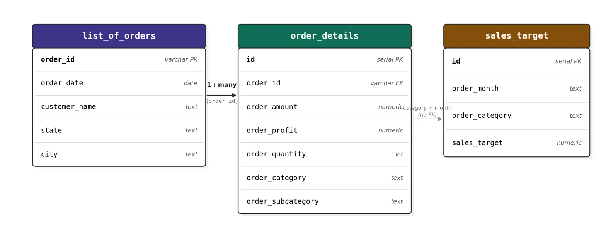

# E-Commerce Sales Analytics (Indian Retail)

## Overview
This project analyzes Indian e-commerce sales data to uncover trends in revenue, 
profit, and performance across product categories, regions, and time.

The workflow starts with designing a normalized PostgreSQL database (3 linked 
tables: orders, order line-items, and monthly sales targets), loading raw CSV 
data into it via a Python ETL script, and extends into Python-based EDA, 
SQL analysis, and an interactive Power BI dashboard.

## Data Source
**Dataset:** E-Commerce Data (Indian retail)  
**Author:** Ben Roshan  
**Platform:** Kaggle  
**URL:** https://www.kaggle.com/datasets/benroshan/ecommerce-data  
**License:** Check Kaggle dataset page for license/usage terms  
**Downloaded on:** [21-08-2026]

## Process
1. Designed a normalized PostgreSQL schema based on identified table relationships
2. Built a Python ETL script to clean and load CSV data into Postgres
3. Performed EDA in Python — merged tables, analyzed revenue/profit trends 
   by category, state, and time; validated findings against sales targets
4. [Coming] SQL analysis — advanced queries (window functions, CTEs)
5. [Coming] Power BI dashboard

## Phase 1: Database Design & Data Loading

Designed a normalized PostgreSQL schema from three raw CSV files, then 
built a Python ETL script to clean and load the data.

### What I did
- Analyzed the raw CSVs (`List of Orders`, `Order Details`, `Sales target`) 
  and identified how they relate to each other
- Verified relationships with code rather than assuming — confirmed 
  `order_id` is unique in `list_of_orders` but repeats in `order_details` 
  (a 1-to-many relationship), since each order can contain multiple line items
- Designed a 3-table relational schema (see [`sql/schema.sql`](sql/schema.sql)):
  - `list_of_orders` — one row per order (dimension table)
  - `order_details` — one row per line item, foreign key to orders (fact table)
  - `sales_target` — monthly targets per category, joined via category + month
- Built a Python ETL script ([`sql/load_data.py`](sql/load_data.py)) using 
  pandas + sqlalchemy to clean and load the CSVs into Postgres

### Schema

### Key Learnings
- **Column name mismatches** between raw CSV headers and SQL schema caused 
  silent failures — `to_sql()` needs exact matches, so renaming has to 
  happen right after loading, before pushing to the database
- **Postgres lowercases unquoted identifiers** — a column created as 
  `Order_id` is actually stored as `order_id`, which caused case-sensitivity 
  errors when pandas quoted column names during insert
- **Date parsing needs `dayfirst=True`** for `DD-MM-YYYY` formatted dates, 
  otherwise Postgres/pandas can silently misinterpret day and month
- **Never hardcode credentials** — moved the database password out of the 
  script and into a `.env` file (excluded from git via `.gitignore`)

### Tools Used
- PostgreSQL — schema design, relational integrity (primary/foreign keys)
- Python (pandas, sqlalchemy) — ETL script
- python-dotenv — secure credential handling

## Phase 2: Python EDA

Pulled data from PostgreSQL into pandas, merged the three tables, and 
explored revenue, profit, and target performance across categories, 
states, and time.

### Key Findings

1. **Category profitability doesn't match revenue.** Electronics leads in 
   revenue, but Clothing has the highest profit margin. Furniture generates 
   solid revenue but has by far the weakest margin.

2. **Revenue is geographically concentrated.** Madhya Pradesh and Maharashtra 
   together account for ~45% of total revenue, far ahead of all other states.

3. **Some states are profit-negative despite generating revenue.** Tamil Nadu, 
   Punjab, Andhra Pradesh, and Bihar show negative total profit — driven by 
   Furniture in AP/Tamil Nadu, and Electronics in Bihar/Punjab.

4. **July 2018 saw a sharp revenue dip**, driven by fewer items per order 
   rather than fewer customers. Breaking it down against sales targets shows 
   Clothing (21% of target) and Furniture (32% of target) nearly collapsed 
   that month, while Electronics held up comparatively well (72%).

**Notebook:** [`notebooks/01_eda.ipynb`](notebooks/01_eda.ipynb)

### Tools Used
- pandas, sqlalchemy — data pulling & merging
- matplotlib — visualization
- python-dotenv — secure credential handling

## Tech Stack
- PostgreSQL — relational database, schema design
- Python (pandas, sqlalchemy, matplotlib) — ETL and EDA
- python-dotenv — secure credential handling
- Wrote advanced SQL queries — window functions and CTEs, validated against Python EDA
- [Coming] Power BI — dashboard

## Key Learnings
This project reinforced the core building blocks of data analysis — designing 
a proper database schema before touching any code, writing a reliable ETL 
pipeline, and letting the data itself (not assumptions) drive analytical 
decisions. Debugging real environment issues (credential security, 
case-sensitivity, working directory mismatches) turned out to be as valuable 
a learning experience as the analysis itself.

## Phase 3: Advanced SQL

Wrote advanced SQL queries directly against the PostgreSQL database, 
using window functions and CTEs to validate and extend the Python EDA findings.

### Queries
1. **Running total of monthly revenue** — window function (`SUM() OVER`) 
   tracking cumulative revenue growth across the year
2. **State revenue ranking** — window function (`RANK() OVER`) ranking 
   all 18 states by total revenue
3. **Loss-making states by category** — a 3-step CTE chain identifying 
   which states have negative profit, then breaking down which category 
   drives the loss in each (Furniture in Andhra Pradesh/Tamil Nadu, 
   Electronics in Bihar/Punjab) — confirming the same finding from the 
   Python EDA phase

**Queries:** [`sql/analysis_queries.sql`](sql/analysis_queries.sql)

### Key Learnings
- Window functions (`OVER`) let you calculate running totals and rankings 
  **without** collapsing rows the way `GROUP BY` does — useful when you need 
  both the detail and the aggregate in the same result
- `WHERE` can't filter on aggregated columns (like `SUM()`) directly, since 
  it runs before grouping happens — CTEs (or `HAVING`) solve this
- CTEs are most